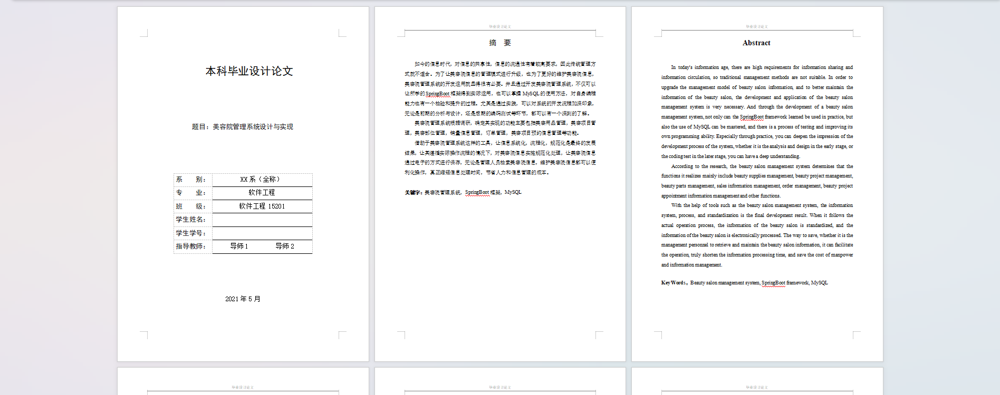
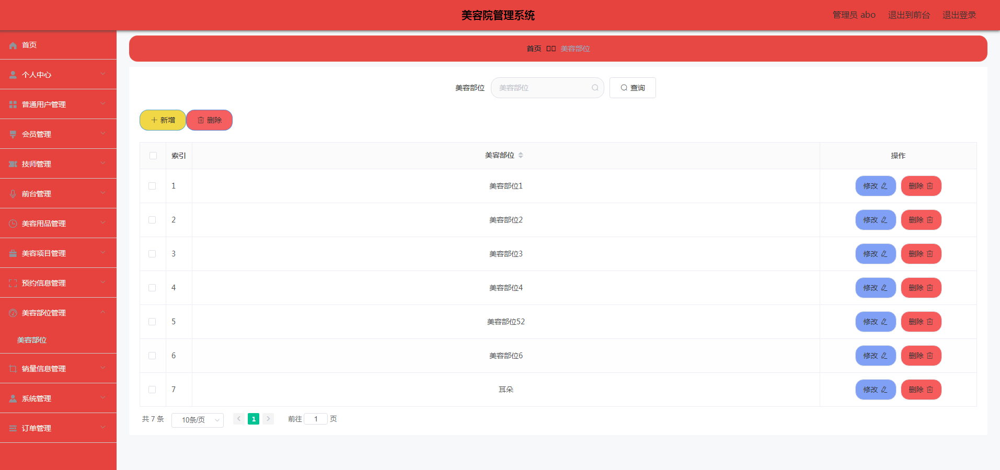
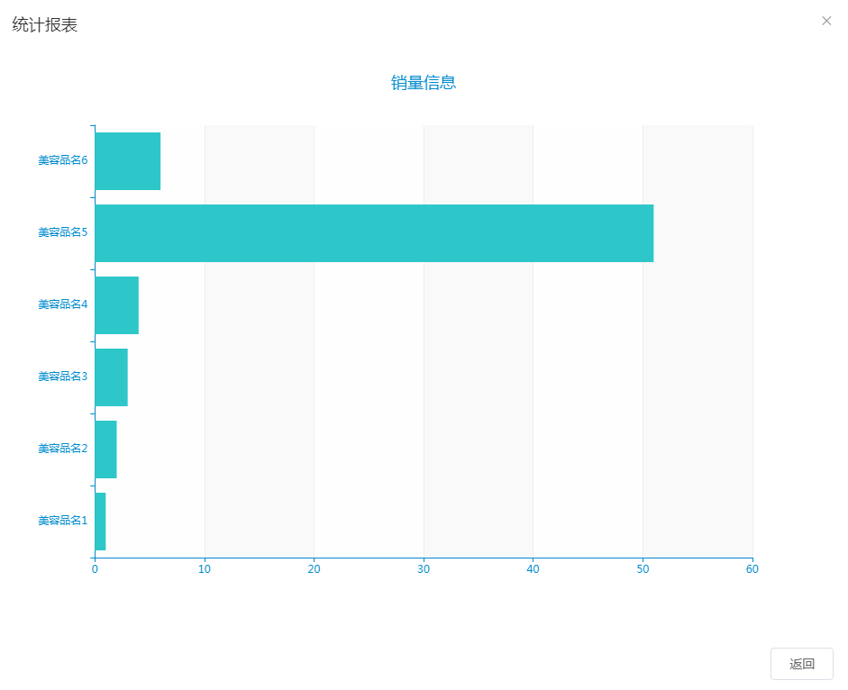
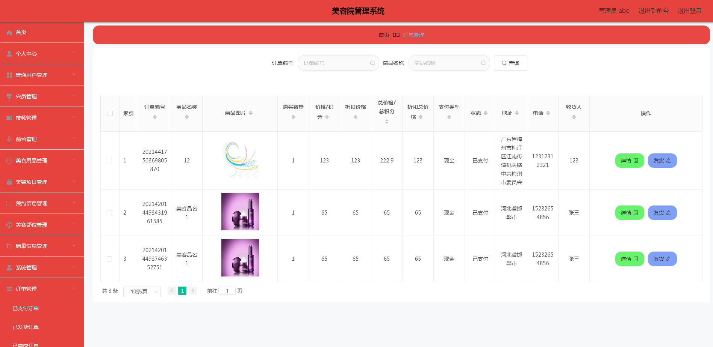
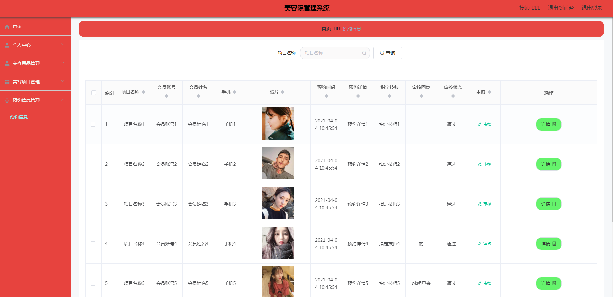
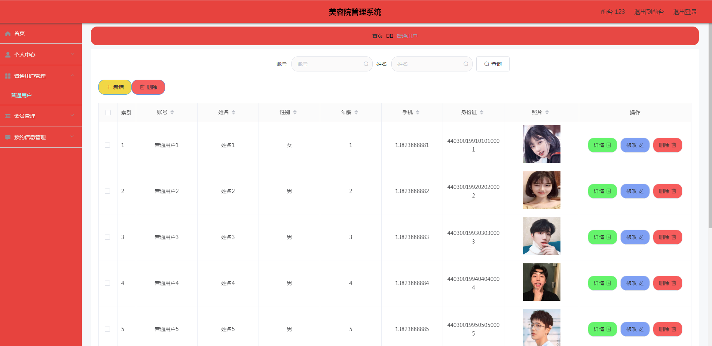
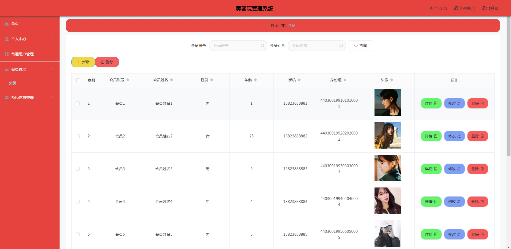

基于Springboot的美容院管理系统（程序+论文）
=
### 完整代码获取地址：从戎源码网 ([https://armycodes.com/](https://armycodes.com/))
### 作者微信：19941326836  QQ：952045282 
### 承接计算机毕业设计、Java毕业设计、Python毕业设计、深度学习、机器学习
### 选题+开题报告+任务书+程序定制+安装调试+论文+答辩ppt 一条龙服务
### 所有选题地址https://github.com/nature924/allProject

一、项目介绍
---
系统包含两种角色：用户、管理员，系统分为前台和后台两大模块，主要功能如下：

### 1管理员功能实现

美容部位管理
实现管理员权限的美容部位管理功能。管理员修改美容部位信息，删除美容部位信息，新增美容部位信息。

销量信息统计
实现管理员权限的销量信息统计功能。管理员通过销量统计报表查看各种美容用品的销量信息。

已支付订单
实现管理员权限的已支付订单功能。管理员查看已支付订单信息，查看下单人提供的收货地址，然后进行订单发货。

### 2技师功能实现

统计美容用品库存
实现技师权限的统计美容用品库存功能。技师可以通过统计报表查看各种美容用品对应的现有库存量。

预约信息管理
实现技师权限的预约信息管理功能。会员预约技师提供的美容项目，技师则需要进行查看和审核。

### 3前台功能实现

普通用户管理
实现前台权限的普通用户管理功能。普通用户的基本信息也能让前台进行增删改查管理。

会员管理
实现前台权限的会员管理功能。会员的基本信息可以让前台进行修改，也能让前台进行查询或删除。

### 4普通用户功能实现

美容用品
实现普通用户权限的美容用品功能。普通用户查看美容用品，在本页面购买美容用品，或把美容用品添加购物车。

购物车
实现普通用户权限的购物车功能。普通用户在本模块购买美容用品，需要提供收货地址，然后选择支付方式支付订单。

我的订单
实现普通用户权限的我的订单功能。普通用户在本模块查看不同状态的订单，已支付订单在未发货前也能退款。

### 5会员功能实现

美容项目
实现会员权限的美容项目功能。会员查看美容项目介绍，预约美容项目。

预约信息管理
实现会员权限的预约信息管理功能。会员提交了美容项目预约信息之后，需要到自己的后台查看预约项目审核情况。

二、项目技术
---
- 编程语言：Java
- 数据库：MySQL
- 项目管理工具：Maven
- 前端技术：VUE、HTML、Jquery、Bootstrap
- 后端技术：Spring、SpringMVC、MyBatis

三、运行环境
---
- 操作系统：Windows、macOS都可以
- JDK版本：JDK1.8以上都可以
- 开发工具：IDEA、Ecplise、Myecplise都可以
- 数据库: MySQL5.7以上都可以
- Tomcat：任意版本都可以
- Maven：任意版本都可以

四、运行截图
---
### 论文截图：

### 程序截图：

